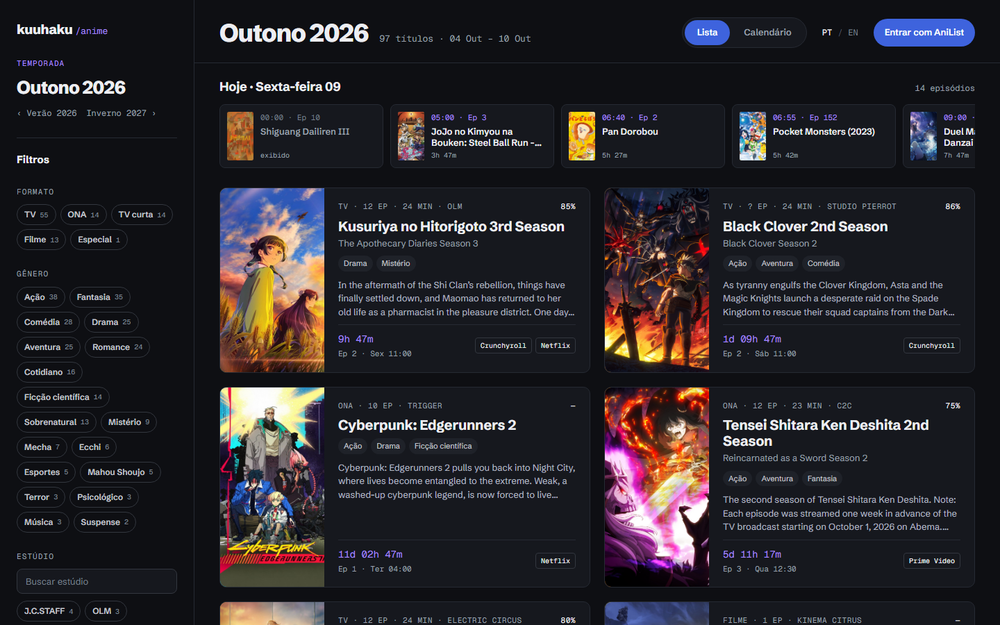
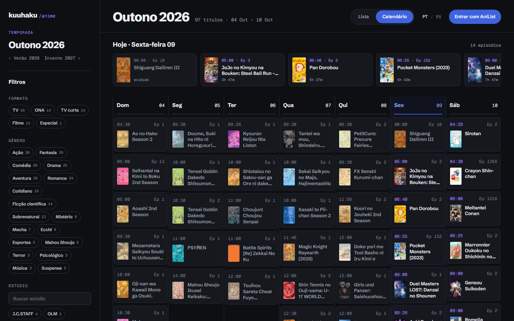
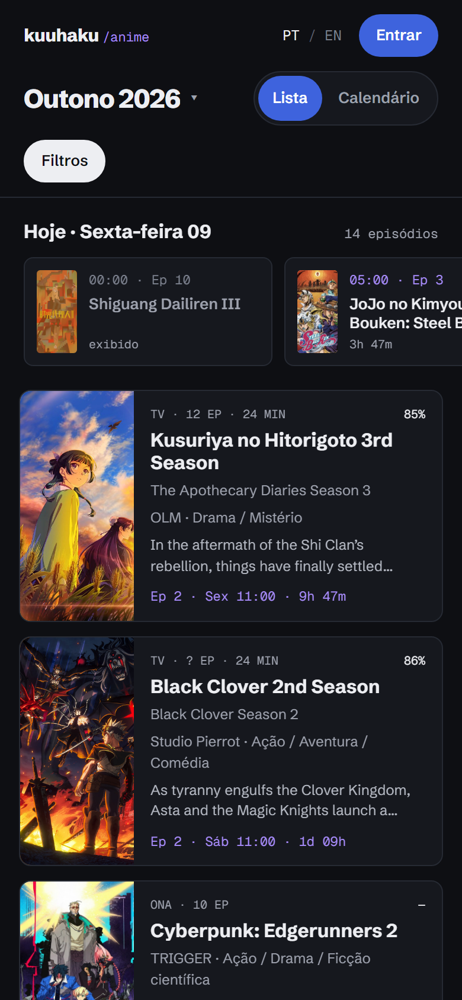
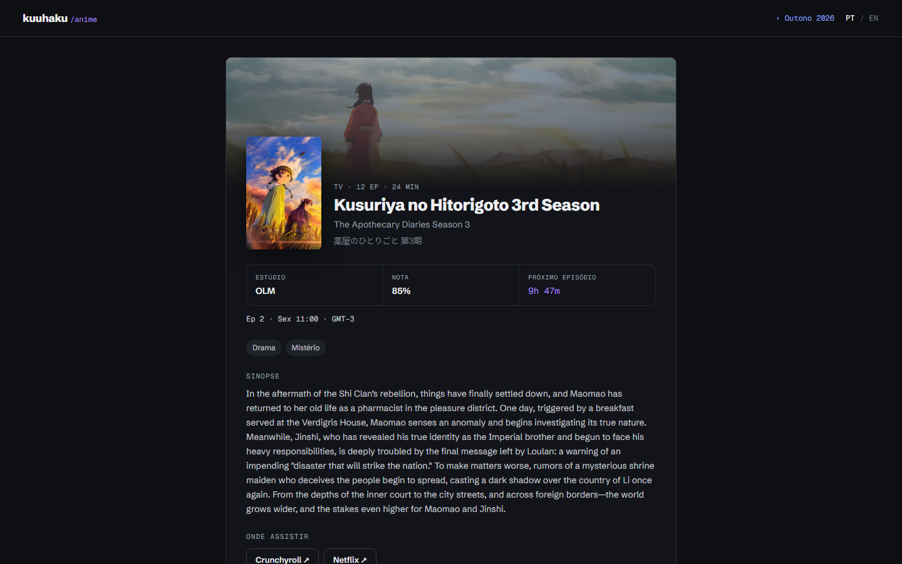

<div align="center">

# kuuhaku/anime

### Anime season calendar: every anime of the season, its air times in your timezone, and where to watch it

**[anime.kuuhaku.dev](https://anime.kuuhaku.dev)** · Calendário de animes da temporada · [Português ↓](#-em-português)

[](https://anime.kuuhaku.dev)
[](https://nextjs.org)
[](https://react.dev)
[](https://tailwindcss.com)
[](https://anilist.co)



</div>

## What it does

**kuuhaku/anime** is a fast, bilingual (Portuguese and English) seasonal anime tracker. Open it and you see the
whole current season (Winter, Spring, Summer or Fall), what airs today, and how long until each next episode, in
**your own timezone**.

- **The season at a glance**: every TV series, ONA, movie and special of the season, sorted by popularity, with
  cover, studio, genres, score and synopsis.
- **Air times in your timezone**: a countdown to every next episode and a "today" strip with what airs in the next
  hours. Daylight saving is handled by the browser, never by hand.
- **Weekly calendar**: the week's episodes laid out day by day, with today highlighted.
- **Filters that matter**: format, genre, studio, *streaming in Brazil* (Crunchyroll, Netflix, Disney+, Prime Video,
  Max, Globoplay) and "only my list".
- **Your AniList list**: log in with AniList to see your progress, what you are behind on, and mark episodes
  watched. Changes sync straight back to AniList.
- **A page for every anime**: synopsis, trailer, the full episode list with air dates, where to watch, and related
  seasons, at a shareable URL.
- **Season archive**: past and upcoming seasons at their own URLs, like
  [`/temporada/outono-2026`](https://anime.kuuhaku.dev/temporada/outono-2026).
- **Phone first-class**: a dedicated mobile layout with a filter sheet and day tabs, not a squeezed desktop.

<table>
  <tr>
    <td width="68%"></td>
    <td width="32%"></td>
  </tr>
  <tr>
    <td colspan="2"></td>
  </tr>
</table>

## 🇧🇷 Em português

**Calendário de animes da temporada** com o horário de lançamento de cada episódio no seu fuso horário. Veja todos
os animes da temporada de inverno, primavera, verão ou outono, o que sai hoje, a contagem regressiva para o próximo
episódio e **onde assistir no Brasil** (Crunchyroll, Netflix, Disney+, Prime Video). Filtre por formato, gênero,
estúdio e streaming, acompanhe sua lista da AniList e marque episódios como vistos. Cada anime tem a própria página,
com sinopse, trailer e a lista de episódios com datas e horários.

Acesse: **[anime.kuuhaku.dev](https://anime.kuuhaku.dev)**

## How it works

| Piece | How |
| --- | --- |
| Data | [AniList's GraphQL API](https://docs.anilist.co): the season (`Page.media`), the week's airing schedule (`airingSchedules`), one anime's details, and the viewer's list |
| Rendering | Next.js App Router. Season and anime pages render on the server and are cached with ISR (hourly for seasons, every six hours per anime), so search engines read real titles and AniList sees one request per page per interval |
| Client data | SWR takes the server's data as its fallback and revalidates in the background; the week, countdowns and local times arrive once the browser knows its clock |
| Timezones | The server prints Brasília time; the browser re-renders in the viewer's zone with `Intl.DateTimeFormat`, so nothing time-based mismatches during hydration |
| Login | AniList OAuth (implicit grant): the token comes back in the URL fragment to `/auth` and stays in the browser |
| State | Zustand for the screen (filters, view, open anime) and the persisted language and session |
| SEO | Per-page titles and descriptions, canonical URLs, JSON-LD (`WebSite`, `ItemList`, `TVSeries`/`Movie`), a sitemap with every season and anime page, `robots.txt`, a generated Open Graph image and a web manifest |

## Tech stack

Next.js 16 (App Router, Turbopack) · React 19 · TypeScript · Tailwind CSS 4 · Zustand · SWR · AniList GraphQL ·
Docker (standalone output) behind Nginx Proxy Manager.

## Run it locally

```bash
pnpm install
pnpm dev
```

The app runs at [localhost:5003](http://localhost:5003). Browsing works without any setup; logging in needs an
AniList API client:

1. Create a client at [anilist.co/settings/developer](https://anilist.co/settings/developer) with the redirect URL
   `http://localhost:5003/auth`.
2. Put its id in `.env`:

   ```bash
   NEXT_PUBLIC_ANILIST_CLIENT_ID=12345
   ```

3. Restart `pnpm dev`. `NEXT_PUBLIC_*` values are baked in at build time.

## Deploy

```bash
docker compose build
docker compose up -d
```

The image ships Next's standalone server on port 5003 as the `anime_calendar` container, on the external
`nginx-proxy` network that Nginx Proxy Manager forwards `anime.kuuhaku.dev` to. The `.env` next to the compose file
is copied into the build, so a new client id needs `docker compose build` again.

## Project layout

```
src/
├── app/
│   ├── (home)/                  the season screen: / and /temporada/[slug]
│   │   ├── _components/         sidebar, headers, cards, calendar, drawer, filter sheet
│   │   ├── _controllers/        the screen's Zustand store
│   │   ├── _hooks/              use_my_list (the AniList list and its writes)
│   │   └── _utils/              filtering and the week's schedule
│   ├── anime/[slug]/            one page per anime
│   ├── auth/                    AniList's OAuth redirect target
│   └── sitemap.ts, robots.ts, manifest.ts
├── components/                  shared: anime detail, cover, language toggle, JSON-LD
├── core/                        models (AniList types, URLs, translations) and app-wide stores
├── hooks/                       use_anilist (SWR over GraphQL), use_now (the shared clock)
├── services/                    the GraphQL client, queries and server loaders
├── utils/                       formatting, display values and SEO metadata
└── styles/                      design tokens and Tailwind theme
```

## Credits

Anime data, covers and banners come from [AniList](https://anilist.co). This project is not affiliated with AniList
or with any streaming service. Streaming links are AniList's and coverage is partial.

Made by [Lucca Gabriel](https://portfolio.kuuhaku.dev).
